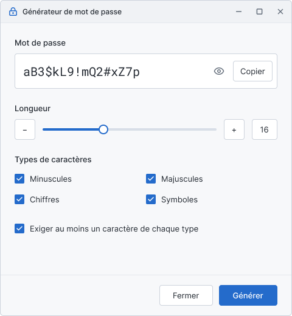
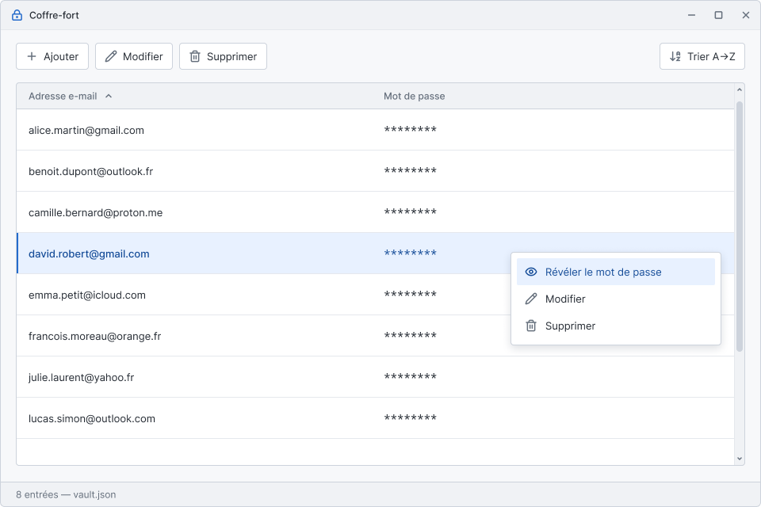

# Gestionnaire de mots de passe — TP1

**Auteur :** VOTRE NOM — VOTRE NUMÉRO D'ÉTUDIANT — GitHub : [itsfranck](https://github.com/itsfranck)

Application Python de génération et de gestion de mots de passe.

- **Partie 1 :** logique de génération (`app/core/`) et interface en ligne de commande (`main.py`).
- **Partie 2 :** interface graphique avec PySide6 (à venir).

## Prérequis

- Python 3.13 ou plus récent
- [uv](https://docs.astral.sh/uv/) pour la gestion de l'environnement virtuel et des dépendances

## Installation

```bash
git clone https://github.com/itsfranck/Tp1-gestionaire-mdp.git
cd Tp1-gestionaire-mdp
uv sync
```

## Utilisation (mode ligne de commande)

```bash
uv run main.py [options]
```

| Option | Description |
|---|---|
| `--length N` | Longueur du mot de passe (par défaut : 16) |
| `--no-lower` | Exclure les lettres minuscules |
| `--no-upper` | Exclure les lettres majuscules |
| `--no-digits` | Exclure les chiffres |
| `--no-symbols` | Exclure les symboles |
| `--validate` | Exiger au moins un caractère de chaque type sélectionné |

### Exemples

```bash
# Mot de passe de 16 caractères avec tous les types
uv run main.py

# Mot de passe de 12 caractères sans symboles, avec validation
uv run main.py --length 12 --no-symbols --validate

# Code de 6 chiffres seulement
uv run main.py --length 6 --no-lower --no-upper --no-symbols
```

Si la configuration est impossible (longueur de 0, aucun type sélectionné, ou longueur trop courte pour la validation), un message d'erreur est affiché.

## Structure du projet

```
Tp1-gestionaire-mdp/
├── .gitignore
├── pyproject.toml
├── uv.lock
├── main.py               # Point d'entrée (mode CLI)
├── README.md
├── doc/                  # Maquettes de l'interface
└── app/
    ├── __init__.py
    └── core/
        ├── __init__.py
        ├── generator.py  # Classe PasswordGenerator
        └── storage.py    # Gestion du fichier JSON (Partie 2)
```

## Maquettes

### Fenêtre de génération de mot de passe



### Fenêtre principale (Coffre-fort)

